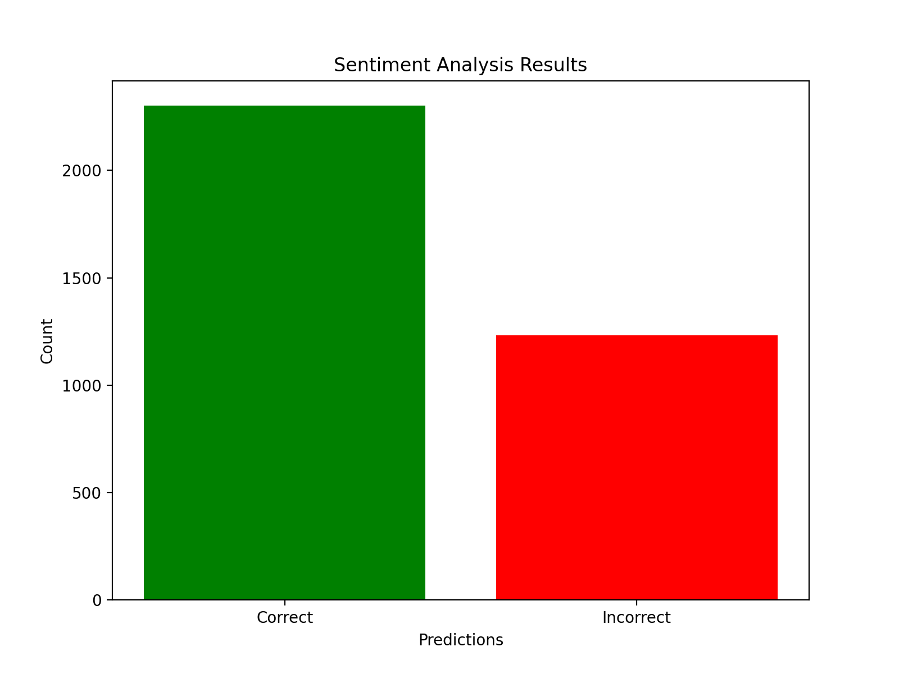

# SENTANALYS

SENTANALYS is a web-based sentiment analysis tool that utilizes natural language processing (NLP) techniques to analyze and determine the sentiment (positive, neutral, or negative) of textual content. The project aims to help users understand the emotional tone and polarity of text data, making it useful for various applications, such as social media monitoring, customer feedback analysis, and more.

## Graphs for [Test Data](./static/data/test.csv)

### Confusion Matrix


### Accuracy Graph



## Tech Stack

- Python (3.10.4)
- Flask
- HTML
- CSS
- JavaScript
- Natural Language Processing (NLP) Stack:
  - NLTK (Natural Language Toolkit)
  - Scikit-learn
  - Matplotlib
  - Pandas
  - Numpy
  - Regular Expressions (Regex)

## Features

- **Sentiment Prediction**: Sentimentinator provides the ability to predict the sentiment of text input, categorizing it as positive, neutral, or negative.

- **Web Interface**: Users can interact with the sentiment analysis tool through a user-friendly web interface.

- **Sample Text Prompts**: The website offers sample text prompts for easy testing and demonstration of the sentiment analysis tool.

- **Data Visualization**: Sentimentinator provides data visualization tools to help users understand the performance of the sentiment analysis model.

## Model Training

To know more about the model training process, please refer to the [Sentiment_Analysis.ipynb](https://github.com/Anish2602/SENTANALYS/blob/main/SENTANALYS.ipynb).

## Installation

1. Clone the repo

   ```bash
   git clone https://github.com/Hardvan/Sentimentinator.git
   ```

2. Navigate to the folder

   ```bash
   cd Sentimentinator
   ```

3. Create a virtual python environment by typing the following in the terminal

   ```bash
   python -m venv .venv
   ```

4. Activate the virtual environment

   Windows:

   ```bash
   .\.venv\Scripts\activate
   ```

   Linux:

   ```bash
   source .venv/bin/activate
   ```

5. Install dependencies by typing the following in the terminal

   ```bash
   pip install -r requirements.txt
   ```

6. Run the app

   ```bash
   python app.py
   ```

7. Click on the link in the terminal to open the website

   It will look something like this:

   ```bash
   Running on http://127.0.0.1:5000
   ```
